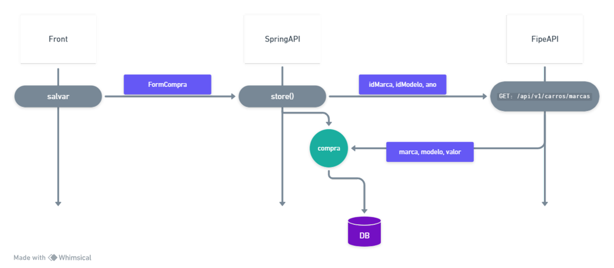
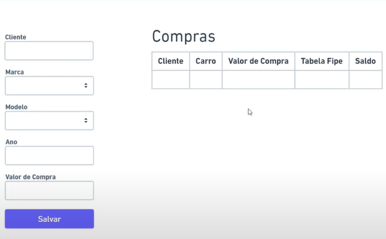

# web-api-cars
creating web api in java spring boot maven with vs code

<p>
  
   
</p>

<details>
<summary>Create Maven project</summary>
#### Install
- [java jdk 17.0.7](https://www.oracle.com/java/technologies/javase/jdk17-archive-downloads.html)

## THIS

1. Add extensions
2. ctrl + shift + p > create a maven project
   - ctrl + shift + p
   - create a maven project
   - 3.1.2
   - java
   - packege
   - webcars
   - jar
   - 17
   - Spring Web
   - Spring Data JPA
   - H2 Data Base
   - Lombok
   - Spring Boot DevTools
   - Select 5 dependencies

## OR
- https://start.spring.io/

## Structure
- model:
  - Compra.java
  - FormCompra.java

- data:
  - CarroRepository.java

- controller:
  - CarrosController.java

- Service:
  - config/Config.java
  - WebcarsApplication.java

</details>

<details>
<summary>Info</summary>

#### VS code extensions
- Extension pack for java
- Spring boot extension pack

#### Snip Codes
- alt + shift + o (importar)
- ctrl + shift + p (criar projeto)

#### LINKS

| Name | Link |
|---|---|
| Spring boot | [start.spring](https://start.spring.io/) |
| Template doc | [rest-template](https://www.baeldung.com/rest-template) |
| Template doc | [rest-template](https://spring.io/blog/2009/03/27/rest-in-spring-3-resttemplate) |
| External Api  | [Api Cars](https://deividfortuna.github.io/fipe/) |
| Sequence diagram  | [whimsical](https://whimsical.com/) |

</details>

<details>
<summary>Start</summary>

- button run OR run in static void main
- http://localhost:8080

| Method | url |
|---|---|
| Get | http://localhost:8080/cars |
| Post | http://localhost:8080/cars |
| H2 bank (web) | http://localhost:8080/h2-console |
| Get | https://parallelum.com.br/fipe/api/v1/carros/marcas/59/modelos/5940/anos/2014-3 |

<details>
<summary>Post /cars</summary>

```json
{
    "client": "Joao", 
    "idBrand": 59, 
    "idModel": 5960, 
    "year": "2004-3", 
    "valueBuy" : 2000 
}
```
</details>


</details>
